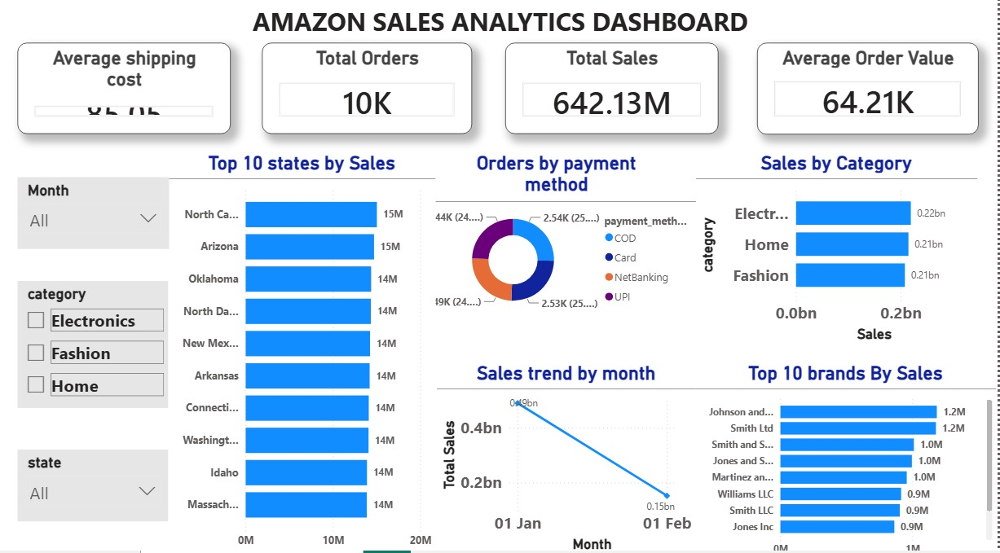

# 📊 Amazon Sales Analytics Dashboard (SQL + Power BI)

## 📌 Project Overview

This project analyzes Amazon sales data using SQL Server and Power BI to identify sales trends, customer purchasing behavior, top-performing products, brands, and states.

The goal of this project is to transform raw sales data into meaningful business insights through SQL analysis and interactive Power BI dashboards.

---

## 🛠️ Tools & Technologies

- SQL Server
- Power BI
- Microsoft Excel / CSV
- GitHub

---

## 📂 Dataset

The dataset contains approximately **10,000 Amazon sales records** with information such as:

- Order ID
- Order Date
- Customer Name
- State
- City
- Category
- Brand
- Product
- Quantity
- Total Sales
- Shipping Cost
- Discount
- Payment Method
- Order Status

---

# 📈 Dashboard KPIs

- 💰 Total Sales
- 📦 Total Orders
- 🛒 Average Order Value
- 🚚 Average Shipping Cost

---

# 📊 Dashboard Visualizations

The Power BI dashboard includes:

- Sales Trend by Month
- Sales by Category
- Top 10 Brands by Sales
- Top 10 States by Sales
- Orders by Payment Method
- Interactive Slicers (Month, Category, State)

---

# 🗄️ SQL Analysis

The project includes SQL queries for:

- Total Orders
- Total Revenue
- Monthly Sales Analysis
- Category-wise Sales
- Brand-wise Sales
- City-wise Sales
- State-wise Sales
- Shipping Cost Analysis
- Discount Analysis
- Customer Order Analysis

---

# 💡 Business Insights

- Generated **642.13 Million** in total sales.
- Successfully completed **10,000 customer orders**.
- Average Order Value reached **64.21K**.
- Average Shipping Cost remained around **85**.
- Electronics category generated the highest sales.
- Johnson and Sons emerged as the top-performing brand.
- North Carolina recorded the highest sales among all states.
- January generated significantly higher sales than February.
- Payment methods were distributed almost evenly across customers.

---

# 📸 Dashboard Preview



---

# 📁 Project Structure

```
Amazon-Sales-SQL-PowerBI-Dashboard
│
├── SQL Queries.sql
├── Amazon Sales Dashboard.pbix
├── Dashboard.png
├── amazon_sales_dataset.csv
└── README.md
```

---

# 🚀 Key Skills Demonstrated

- SQL Data Analysis
- Aggregations
- GROUP BY
- ORDER BY
- Business KPI Analysis
- Data Visualization
- Power BI Dashboard Design
- Interactive Slicers
- Business Insight Generation

---

# 🎯 Project Outcome

This project demonstrates the complete workflow of a Data Analyst:

- Data Exploration
- SQL Query Writing
- Business Insight Extraction
- Dashboard Development
- Data Storytelling
- GitHub Project Documentation

---

## 👨‍💻 Author

**Vishnu Prajapati**

Aspiring Data Analyst

📌 SQL | Power BI | Excel | Data Analytics

---

⭐ If you found this project useful, feel free to star the repository.
